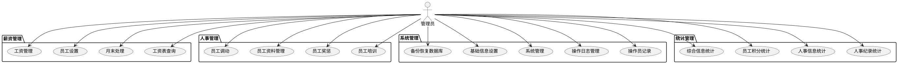
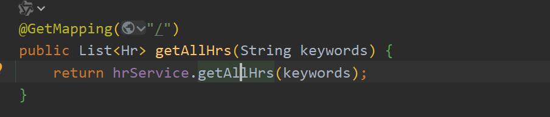
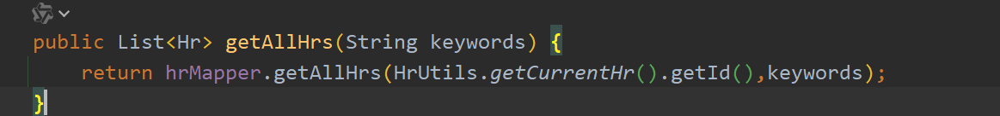
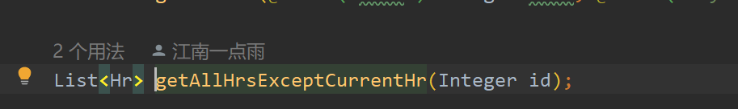
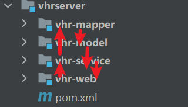
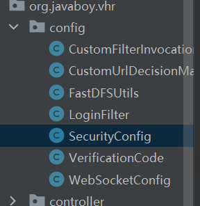

## 这是关于kdc的代码泛读
### 项目用例图

### 从`ChatContorller`看项目整体架构
> 项目是一个典型的mvc架构，`HrContorller`作为控制器，`HrService`作为业务层，`HrMapper`作为数据层，`Hr`作为模型层，`HrContorller`调用`HrService`，`HrService`调用`HrMapper`，`HrMapper`调用数据库。
- 我们从getAllHrs获取所有hr的个人信息

- getAllHr调用HrService

- HrService调用HrMapper

### 从项目包图看项目架构

- 项目在mvc架构下完成crud操作

- 通过aop切面编程将核心逻辑进行解耦