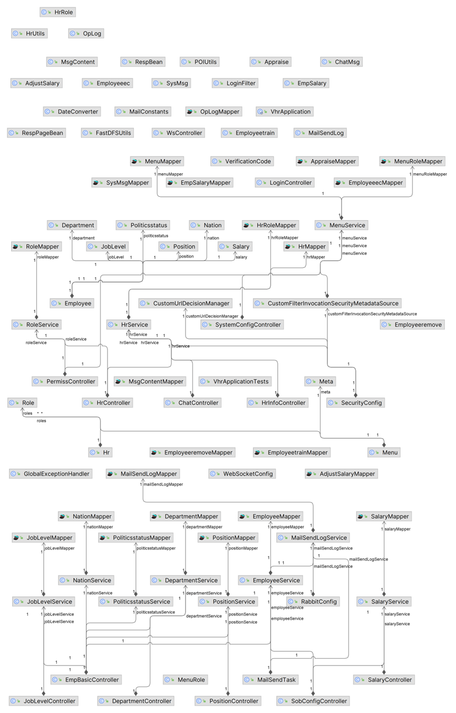

## 这是关于lgy的代码泛读
### 类之间的调用关系图

### 核心类的主要作用
- 核心类：EmpBasicController.java 是一个控制器类，负责处理与员工基本信息相关的请求。其主要功能包括：
1.	分页查询员工信息：通过 getEmployeeByPage() 方法实现，支持根据页码、每页大小、员工信息及日期范围进行分页查询。
2.	添加员工信息：通过 addEmp() 方法实现，用于新增员工信息。
3.	删除员工信息：通过 deleteEmpByEid() 方法实现，根据员工ID删除指定员工信息。
4.	更新员工信息：通过 updateEmp() 方法实现，用于修改现有员工信息。
5.	获取辅助信息：通过 getAllNations()、getAllPoliticsstatus()、getAllJobLevels()、getAllPositions() 和 getAllDepartments() 方法，分别获取所有民族、政治面貌、职称、职位和部门信息。
6.	获取最大工号：通过 maxWorkID() 方法获取当前最大工号，并返回递增后的工号。
7.	导出员工信息：通过 exportData() 方法将员工信息导出为 Excel 文件。
8.	导入员工信息：通过 importData() 方法实现，从上传的 Excel 文件中读取员工信息并批量导入数据库。
该类通过 RESTful API 提供了对员工基本信息的增删改查操作，并支持员工信息的导入导出功能，便于管理人员高效管理员工数据
